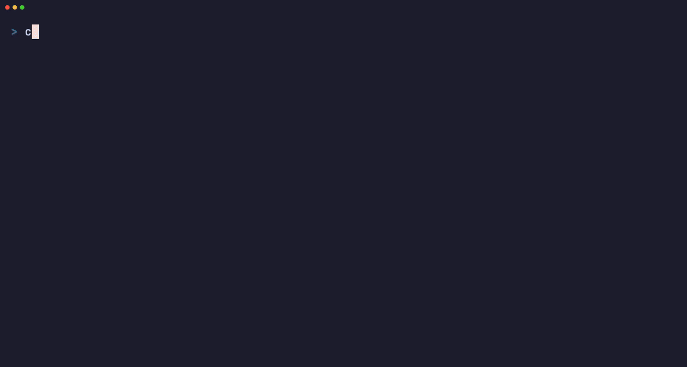
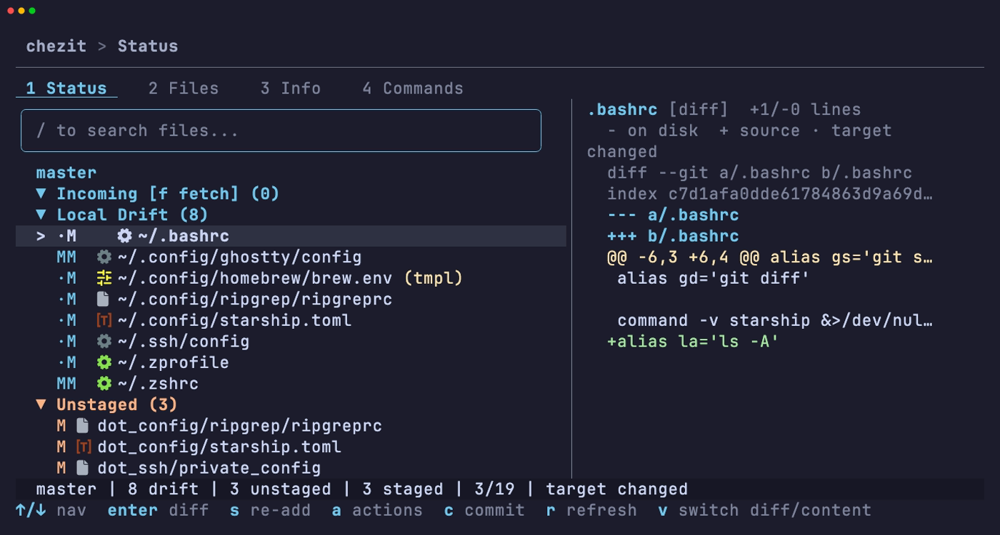
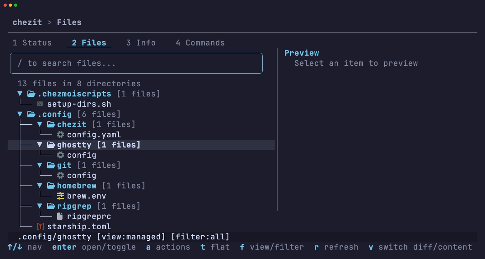
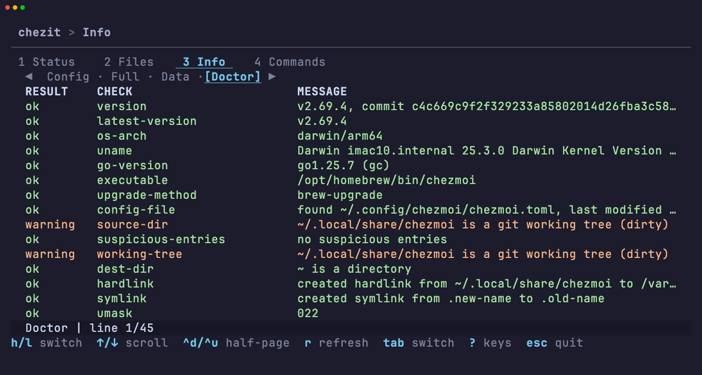
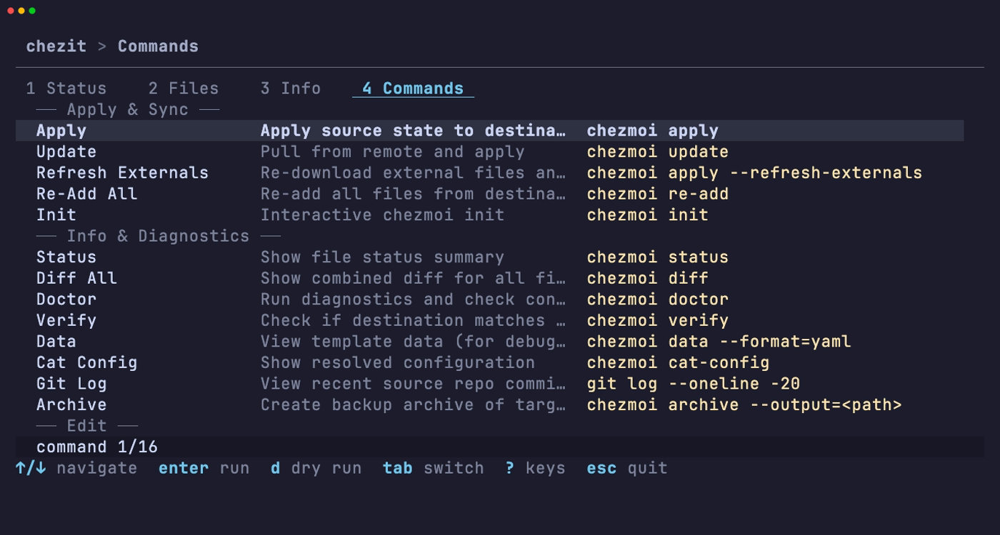

# chezit

[](https://github.com/daptify14/chezit/actions/workflows/ci.yml)
[](LICENSE)

A terminal UI for [chezmoi](https://www.chezmoi.io/) dotfile management.

Browse changes, view diffs, stage/unstage files, commit, push, and run chezmoi commands interactively.



## Install

### Requirements

- [`chezmoi`](https://www.chezmoi.io/install/) -- must be installed and initialized
- [Nerd Font](https://www.nerdfonts.com/) (optional) -- enables file-type icons in the default `nerdfont` mode; set `icons: unicode` or `icons: none` in config if not installed

### Homebrew

```bash
brew install daptify14/tap/chezit
```

### Pre-built binaries

Download from [GitHub Releases](https://github.com/daptify14/chezit/releases) (macOS and Linux, arm64 and amd64).

### From source

```bash
go install github.com/daptify14/chezit/cmd/chezit@latest
```

## Usage

```bash
chezit              # open the landing menu
chezit status       # jump to Status tab
chezit files        # jump to Files tab
chezit info         # jump to Info tab
chezit commands     # jump to Commands tab
chezit --version    # print version
```

## Tabs

### Status



Organized into sections — Incoming, Local Drift, Unstaged, Staged, and Unpushed Commits — covering upstream changes, source/target drift, and git operations from staging through push. Each section offers context-aware actions, with diffs or file content shown in the side panel.

Local Drift distinguishes source/target state:

- `M·` means source-only change (`pending apply`)
- `·M` means target-only change (`target changed`)
- `MM` means both sides changed (`diverged`)
- `R·` on script entries means script source changed (`pending script run`)

`·` marks the side with no change. When a drift row is selected, its subtype label (e.g. `pending apply`) appears in the status bar and panel header.

#### Key bindings

| Key | Action |
|-----|--------|
| `Enter` | Open diff / toggle section |
| `Shift+↑/↓` | Range select |
| `s` / `S` | Stage / stage all (or re-add when applicable) |
| `u` / `U` | Unstage / unstage all |
| `x` | Discard / undo |
| `e` | Edit file |
| `c` | Commit staged |
| `P` | Push |
| `f` / `p` | Fetch / pull |
| `a` | Actions menu |
| `r` | Refresh |

### Files



Browse dotfiles in tree or flat view with fuzzy search and filtering by status (Managed / Ignored / Unmanaged / All). Deep-search your target directory to find unmanaged files and add them to chezmoi. Actions include add, apply, forget, edit, and more.

#### Key bindings

| Key | Action |
|-----|--------|
| `Enter` / `l` / `space` | Expand directory (tree) / open actions (flat) |
| `h` | Collapse directory (tree) |
| `t` | Tree / flat toggle |
| `f` | View/filter picker |
| `F` | Jump to filter section in picker |
| `c` | Clear active search (tree mode only) |
| `a` | Actions menu |
| `r` | Refresh |

### Info



View your chezmoi config file, full computed config, template data, and `chezmoi doctor` output in one place — useful for debugging templates or verifying your setup.

#### Key bindings

| Key | Action |
|-----|--------|
| `←` / `→` or `h` / `l` | Previous / next sub-view |
| `↑/↓` or `j/k` | Scroll |
| `Ctrl+d` / `Ctrl+u` | Half-page down / up |
| `Ctrl+f` / `Ctrl+b` | Full-page down / up |
| `f` | Toggle yaml/json format |
| `r` | Refresh |

### Commands



Quick access to common chezmoi operations (apply, update, re-add, doctor, verify, and more) with optional dry-run mode.

#### Key bindings

| Key | Action |
|-----|--------|
| `Enter` | Run command |
| `d` | Dry run |

## Preview Panel

Shows in Status and Files tabs when the terminal is wide enough. Displays diffs or file content with syntax highlighting. For drift files, detail lines include subtype labels (`pending apply`, `target changed`, `diverged`, `pending script run`).

| Key | Action |
|-----|--------|
| `p` | Show/hide panel |
| `→/l` / `←/h` | Focus panel / return to list |
| `v` | Switch diff/content mode |
| `↑/↓` or `j/k` | Scroll |
| `Ctrl+d` / `Ctrl+u` | Half-page down / up |

<details>
<summary>Global key bindings</summary>

| Key | Action |
|-----|--------|
| `Tab` / `Shift+Tab` / `1-4` | Next / previous / jump to tab |
| `j/k` or `↑/↓` | Navigate |
| `g` / `G` | Jump top / bottom |
| `Enter` | Select / expand |
| `/` | Filter/search |
| `m` | Toggle mouse mode (off allows terminal text selection) |
| `?` | Help overlay |
| `Esc` | Back |
| `q` / `Ctrl+C` | Quit |

</details>

## Configuration

`chezit` reads `~/.config/chezit/config.yaml` when present.

```yaml
icons: nerdfont      # nerdfont | unicode | none
mode: write          # write | read_only
panel: auto          # auto | show | hide
commit_presets: []   # e.g. ["dotfiles: update config"]
binary_path: ""      # e.g. /opt/homebrew/bin/chezmoi (only needed when chezmoi is not on $PATH)
```

Colors adapt automatically to your terminal background (dark or light) at startup using Catppuccin palettes.

Defaults are shown in the YAML example above.

| Key | Accepted values | Behavior / when to change |
|-----|------------------|---------------------------|
| `icons` | `nerdfont`, `unicode`, `none` | `nerdfont` gives rich icons (requires [Nerd Font](https://www.nerdfonts.com/)); use `unicode` or `none` for maximum compatibility. |
| `mode` | `write`, `read_only` | `read_only` disables mutating actions (apply, re-add, stage, commit, push). |
| `panel` | `auto`, `show`, `hide` | `auto` shows the preview only when terminal width allows. |
| `commit_presets` | list of strings | Optional preset commit messages shown in the commit flow. |
| `binary_path` | path to `chezmoi` binary (`~` supported) | Set only if `chezmoi` is not on `PATH`. |

## Development

Requires Go 1.26+ and [task](https://taskfile.dev/). Uses Bubble Tea v2, Lip Gloss v2, and Bubbles v2. Huh v2 is still pre-release.

```bash
task setup          # install dev tools and git hooks
task fmt            # format code (gofumpt + gci via golangci-lint)
task check          # run all checks (fmt, lint, test)
task test           # run tests (supports filters via --, e.g. task test -- -run TestGolden)
task test-update    # regenerate golden snapshot files
task test-update -- -run TestGoldenStatusTab|TestGoldenActionsMenu  # regenerate status-related golden snapshots
```

Notes:

- `task setup` installs local dev tools (`golangci-lint`, `svu`, `goreleaser`) to `./bin/` and sets up Git hooks via `lefthook`. `lefthook` itself is installed globally via `go install`, so ensure `$(go env GOPATH)/bin` is on your `$PATH`.
- Use `task test` for quick local iteration; run `task check` before opening a PR.

## Contributing

Contributions are welcome -- feel free to open an issue or send a PR. Run `task check` before submitting to make sure everything passes. See [Development](#development) for setup.

## Acknowledgments

Built on top of [chezmoi](https://www.chezmoi.io/), a fantastic dotfile manager. Under the hood, chezit uses [Bubble Tea v2](https://github.com/charmbracelet/bubbletea), [Lip Gloss v2](https://github.com/charmbracelet/lipgloss), [Cobra](https://github.com/spf13/cobra), [Chroma](https://github.com/alecthomas/chroma), and [Catppuccin](https://github.com/catppuccin/catppuccin).

## License

MIT -- see [LICENSE](LICENSE).
